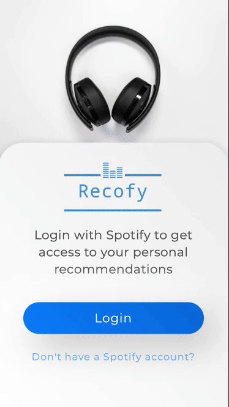

  

---

 

# Capstone project: Recofy

**Welcome to Spotify Recommendations alias Recofy.**

Let Recofy join your daily routine. Select your mood and get your personal Song recommendations, save them to your Spotify Account or access your recommendation history and groove on.

Its a perfect match if you are:

- ...annoyed by your own music which plays on repeat all day
- ...the "one mix of the week ain't enough to keep you grooving" type
- ...the 'show me your Spotify account and I tell you who you are'-type

---

 

## Goal for MVP

- Create playable Playlists like the "mix of the week" by spotify on demand

 

## Result MVP

## Tools & Libraries used

- React
- Typescript
- Node.js
- Express
- MongoDB
- Spotify API

## Challenges

- Work with TS interfaces provided by the API as base for custom interfaces
- Synchronise mongoDb & Spotify to create Sotify Playlists while keeping a separated history
- Implement a spinner to select the current Mood without performance issues
- Implement Spotify auth process

## How to set it up

- Setup Spotify dashboard & register your app (& whitelist your Redirect uri - typical is `http://localhost3000`)[Spotify Dev Dashboard](https://developer.spotify.com/dashboard)
- Setup a mongoDB & create a collection `user`
- Clone this repository
- Add an `.env` in your root folder with the key: `MONGODB_URL`
- Add an `.env` in `./client` with the keys: `REACT_APP_CLIENT_ID`, `REACT_APP_CLIENT_SECRET`, `REACT_APP_REDIRECT_URI`
- Install all dependencies `npm install`
- To run the app in development mode run `npm run dev`
- To run the tests run `npm run test`
- To run TSLint run `npm run lint`
